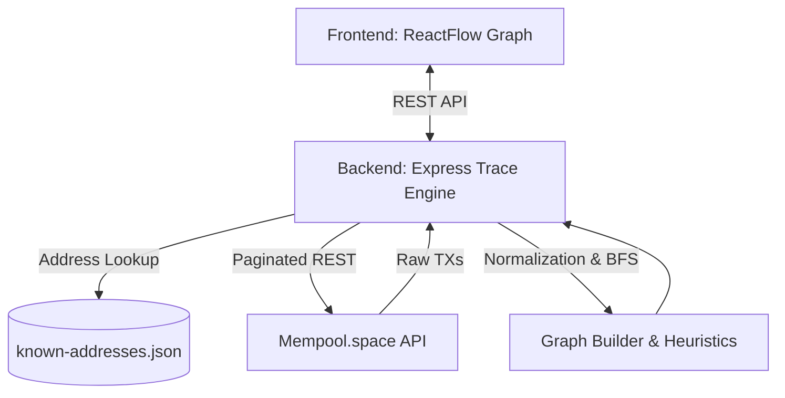

# Crypto Forensics Tracer

## Overview
Crypto Forensics Tracer is an advanced investigative tool that analyzes Bitcoin blockchain transactions. It maps out fund flows from a given starting wallet address, visualizes the transaction graph interactively in the browser, and highlights key intelligence such as known exchange entities and highly probable change-addresses.

## Problem Statement
Tracing cryptocurrency manually through block explorers is tedious, error-prone, and visually overwhelming. Investigators easily lose the trail when funds split into multiple outputs or bounce through intermediary change addresses. Without automated heuristics, it's difficult to separate the primary fund flow from administrative blockchain mechanics, and challenging to know when the funds have reached a centralized off-ramp (like an exchange).

## What the System Does
This system connects directly to the public Bitcoin blockchain (via Mempool.space) to recursively trace outbound transactions from a given address. It normalizes transaction data, builds an address-level graph abstraction, applies forensic heuristics to prune noise, and identifies the most likely "Candidate Endpoint" where the trace concludes.

## Key Features
- **Recursive BFS Tracing**: Automatically follows outbound funds layer by layer up to a configurable depth limit.
- **Investigator Trace Controls**: Provides UI controls to safely bound traces by Depth (1-5) and Node Count (1-50) to manage complexity and rate limits.
- **Known-Address Attribution**: Automatically decorates the graph with intelligence from a localized `known-addresses.json` database.
- **Potential Change-Address Heuristics**: Identifies and visually flags likely change outputs (e.g. self-returns or >90% single-output anomalies) to help investigators ignore noise.
- **Candidate Endpoint Scoring**: Programmatically determines the most significant end wallet in the trace, heavily prioritizing known entities.
- **Interactive Transaction Graph**: Renders the complete trace topology visually using `ReactFlow`, supporting drag/drop, zoom, and dynamic layouts.
- **Investigation Summary**: Provides a high-level statistical breakdown of the trace (unique addresses, max depth, entities found).
- **Transaction Details Panel**: Allows deep-dive inspection of any node or edge in the graph, with one-click copy functionality.

## High-Level Architecture
1. **Frontend (React)**: Captures user input (Trace Controls, Address), orchestrates trace requests, and visualizes the resultant topology.
2. **Backend (Node.js/Express)**: Manages blockchain fetching, data normalization, recursive pathfinding logic, and heuristic application.
3. **Data Layer (Mempool API)**: Public blockchain data is retrieved in real-time. Pagination is handled internally to ensure complete transaction histories up to 150 transactions per node.



## End-to-End Data Flow
1. **Bitcoin Address** is submitted via the UI.
2. **Mempool.space API** is polled for the complete paginated transaction history of the address.
3. **Transaction Normalization** flattens the raw JSON into standard inputs and outputs.
4. **Address-Level Graph** connects input addresses to output addresses.
5. **Recursive Depth-Limited Fetching** expands the graph using Breadth-First Search (BFS) on outbound outputs until bounds are hit.
6. **Known-Address / Change Heuristics** score and flag the nodes.
7. **Candidate Endpoint** logic selects the most probable terminal destination.
8. **Frontend Summary + Graph + Details** receive the JSON payload and render the forensic visualization.

## Backend Architecture
- `server.ts` / `app.ts`: Express application entry points; handles API routing and query parameter validation.
- `blockchain/client.ts`: Interfaces with Mempool.space, handles rate limits, and paginates transaction histories (up to 3 pages / 150 txs).
- `tracing/graph.ts`: Constructs the directed adjacency graph from normalized transactions. Contains the core change-address heuristic logic.
- `tracing/engine.ts`: Executes the BFS traversal over the graph, bounded by the dynamic `maxDepth`.
- `tracing/service.ts`: Orchestrates the trace loop, enforces `maxNodes` limits, manages the localized known-entity cache, and formats the final payload.

## Frontend Architecture
- `App.tsx`: Main application orchestrator managing search state, Trace Controls, and child components.
- `TraceService.ts`: HTTP client logic for bridging the UI with the backend API.
- `TransactionGraph.tsx`: Uses `@xyflow/react` and `dagre` to render and auto-layout the directed graph topology visually.
- `InvestigationSummary.tsx`: Parses trace statistics (depth, entities, candidate endpoint) into a concise reporting dashboard.
- `TransactionDetailsPanel.tsx`: Interactive sidebar that displays raw JSON metadata when a user clicks a node or edge.

## Technology Stack
- **Backend**: Node.js, Express, TypeScript, Vitest
- **Frontend**: React 18, Vite, TypeScript, ReactFlow (xyflow), TailwindCSS, Lucide React
- **Data Source**: Mempool.space public REST API

## Setup and Installation

### Backend Setup
```bash
cd crypto-tracer
npm install
```

### Frontend Setup
```bash
cd frontend
npm install
```

## Environment Variables and Configuration
No `.env` file is required for the default Mempool.space public API. However, a template is provided at `crypto-tracer/.env.example` if you wish to configure upstream node URIs in the future.

The known entities database is located at `crypto-tracer/data/known-addresses.json`. You can safely add JSON objects to this array to extend local intelligence.

## Running the Application

### How to Run the Backend
```bash
cd crypto-tracer
npm run dev:server
# Runs on http://localhost:3000
```

### How to Run the Frontend
```bash
cd frontend
npm run dev
# Runs on http://localhost:5173
```

### How to Run Tests and Production Builds

**Backend:**
```bash
cd crypto-tracer
npm run test     # Run Vitest test suite
npm run build    # Compile TypeScript
```

**Frontend:**
```bash
cd frontend
npm run test     # Run Vitest test suite
npm run build    # Build optimized Vite bundle
```

## Example Tracing Workflow
1. Start both servers. Navigate to `http://localhost:5173`.
2. Enter a suspect Bitcoin address into the search bar.
3. Configure the **Trace Controls** (e.g. Max Depth: 3, Max Addresses: 50).
4. Click **Trace Funds**.
5. Observe the **Investigation Summary** for the Candidate Endpoint.
6. Review the visual graph. Gray dashed nodes indicate probable change addresses; Blue solid nodes indicate known entities.
7. Click any edge to view specific transaction hashes and amounts in the **Details Panel**.

## Investigator Trace Controls
The system implements strict safeguards to protect against infinite recursion and upstream rate-limits.
- **Max Depth**: Enforces how many "hops" away from the origin the tracer will search (1 to 5).
- **Max Fetched Addrs**: Enforces a strict limit on the number of addresses the engine will actively query for history from the blockchain (1 to 50). Note: This limits *API fetches/branching*, not the total absolute size of the graph. A single API fetch can discover hundreds of addresses, meaning a trace with a fetch limit of 50 can easily yield a graph of thousands of discovered addresses.

## Known-Address Attribution
The system maps addresses against `data/known-addresses.json`. When a match is found, the node is flagged with its institutional label and `entityType` (e.g., Exchange, Mixer). Traces *do not* artificially stop at known entities, but these entities are heavily prioritized in candidate scoring.

## Potential Change-Address Heuristics
Because Bitcoin uses a UTXO model, distinguishing a payment from a change-return is difficult. The graph flags outputs as `Potential Change` if:
1. The funds return to the exact same address that sent them.
2. A single output receives >90% of the entire input value of the transaction.
These nodes are de-prioritized visually and programmatically.

## Candidate Endpoint Logic
The system attempts to identify the most likely terminal destination of the funds by scoring the graph. Known Entities receive massive score boosts. Potential Change addresses are aggressively penalized. Depth and transaction volumes serve as tie-breakers.

## Forensic and Technical Limitations
**DISCLAIMER**: This tool is an investigative aid, not cryptographic proof of identity.

- **Address-Level Abstraction**: The current graph is an address-level abstraction over Bitcoin's native UTXO model. It is not a perfect UTXO-level coin-tracking mechanism.
- **Change Heuristics are Guesses**: Change-address detection relies strictly on heuristics (e.g., >90% thresholds) and is susceptible to false positives (e.g., legitimate large payments).
- **Bounded Trace Depth**: The graph is constrained by configured limits. Relevant fund movements may occur beyond the trace bounds.
- **Mempool Pagination Limit**: The system currently paginates up to 150 recent transactions per address. Extremely active wallets may have earlier history silently truncated.
- **Mixers and Tumblers**: The graph cannot cleanly map or de-anonymize complex CoinJoin, mixer, or tumbler patterns.
- **Attribution Limitations**: `known-addresses.json` relies entirely on static, user-provided intelligence.
- **Wallet-to-Person Identity**: This system maps *addresses* to *institutional entities* (like exchanges). **Wallet-to-person attribution is NOT performed.**
- **No Cross-Chain Tracing**: Only the Bitcoin blockchain is supported.
- **No Machine Learning Claims**: This software does not use ML for fraud detection or algorithmic prediction.

## Future Scope
- **UTXO-Aware Modeling**: Shifting the core data engine from an address-level abstraction to a strict UTXO fund-flow model.
- **Advanced Heuristics**: Implementing more robust change-address and wallet-clustering heuristics (e.g., common-input clustering).
- **Richer Intelligence**: Integrating third-party APIs for live threat-scoring and known-entity matching.
- **Mixer Analysis**: Introducing specific graph patterns to detect and flag automated tumbling services.
- **Exporting**: Exporting graph topologies to PDF/CSV for formal evidence reporting.
- **Cross-Chain**: Adding support for EVM-based chains (Ethereum) using similar recursive logic.

## Testing and Verification Status
- **Backend**: 19 tests passing (100% coverage on pathfinding logic, pagination mocks, and limit enforcement).
- **Frontend**: 14 tests passing (coverage for ReactFlow integration, Trace Controls, and Summary calculations).
- **Builds**: Fully compiling in strict TypeScript environments.

---
**Responsible-Use Disclaimer**: Blockchain data alone does not prove ownership, control, or criminal activity. Candidate endpoints are investigative leads, not definitive factual conclusions. Always corroborate tracing data with off-chain evidence (e.g., subpoenas, KYC records).
