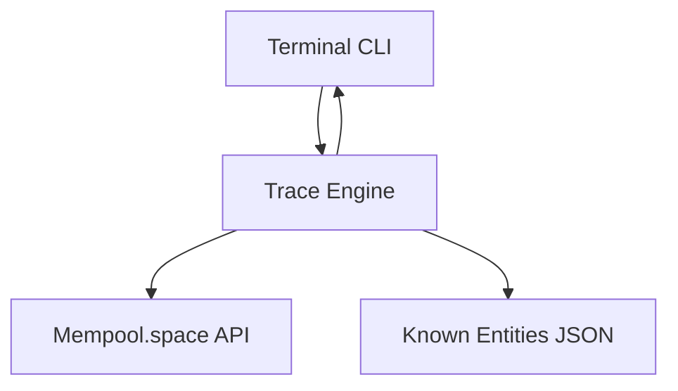

# Crypto Forensics Tracer

A high-performance, heuristics-driven cryptocurrency transaction tracing engine natively built as a Node.js Terminal Application.

## Project Overview
The Crypto Forensics Tracer allows investigators and researchers to perform automated, breadth-first traversal of the Bitcoin blockchain directly from their terminal. It securely connects to public blockchain APIs, unwinds transaction histories, matches entities against known institutional datasets, and evaluates heuristics to identify target endpoints (such as exchanges, mixers, or cold storage).

## Problem Addressed
Tracing funds manually across public block explorers is a slow, error-prone, and visually overwhelming process. When funds move rapidly through obfuscation techniques (like mixers or change-address splitting), maintaining a clear forensic chain of custody becomes difficult. This tool automates the recursive traversal and algorithmically extracts intelligence to speed up forensic analysis.

## Key Features
- **Breadth-First Recursive Tracing**: Expands transaction inputs and outputs up to a user-defined depth.
- **Trace Controls**: Bounded execution via Max Depth (1-5 hops) and Max Fetches limits to protect against unbounded recursion.
- **Known Entity Attribution**: Automatically maps encountered addresses against a structured dataset of known exchanges, services, and mixers.
- **Change-Address Detection**: Employs heuristics (e.g., self-returning inputs, >90% output concentration) to flag and penalize non-transfer paths.
- **Endpoint Scoring**: Algorithmically surfaces the most probable "Candidate Endpoint" (the wallet/institution where the funds were ultimately deposited) based on trace depth, entity tags, and transaction values.
- **Terminal UI**: Elegant CLI interface with loader spinners and color-coded Investigation Summaries.

## Architecture



## Technology Stack
- **Core Engine**: Node.js, TypeScript
- **CLI Tools**: Commander.js, Chalk, Ora
- **Testing**: Vitest
- **Data Source**: Mempool.space REST API

## Setup and Installation

### Requirements
- Node.js (v18+)
- npm

### Installation
1. Clone the repository
2. Navigate into the application directory:
```bash
cd crypto-tracer
```
3. Install dependencies:
```bash
npm install
```

## How to Run the Tracer

To run a trace against a Bitcoin address, use the `trace` command:

```bash
npm run dev -- trace <bitcoin_address>
```

**Example (Satoshi's Genesis Address):**
```bash
npm run dev -- trace 1A1zP1eP5QGefi2DMPTfTL5SLmv7DivfNa
```

### Trace Controls
The system implements strict safeguards to protect against infinite recursion and upstream rate-limits.

- **`-d, --depth <number>`**: Enforces how many "hops" away from the origin the tracer will search (1 to 5).
- **`-n, --nodes <number>`**: Enforces a strict limit on the number of addresses the engine will actively query for history from the blockchain (1 to 50). *Note: A single API fetch can discover hundreds of addresses, meaning a trace with a fetch limit of 50 can easily yield a graph of thousands of discovered addresses.*

**Example with custom limits:**
```bash
npm run dev -- trace bc1qxy2kgdygjrsqtzq2n0yrf2493p83kkfjhx0wlh -d 2 -n 10
```

## Forensic Terminology
- **Known Entity**: An address matched to `data/known-addresses.json`. The system *never* assumes definitive personal identity; it only identifies the managing institution/service.
- **Potential Change**: An output heuristically flagged as a likely return path to the sender. These are penalized in Candidate scoring to avoid false endpoints.
- **Candidate Endpoint**: The single most statistically probable destination for the traced funds, factoring in depth, institutional attribution, and transaction structure.

## Testing
To run the underlying engine and CLI tests:
```bash
npm test
```
*(Tests cover engine pathfinding, graph bounding, heuristic logic, and CLI parameter parsing)*
